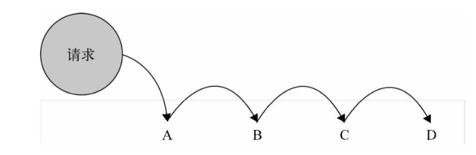

### 职责链模式

职责链模式的定义是：使多个对象都有机会处理请求，从而避免请求的发送者和接收者之间的耦合关系，将这些对象连成一条链，并沿着这条链传递该请求，直到有一个对象处理它为止。

职责链模式的名字非常形象，一系列可能会处理请求的对象被连接成一条链，请求在这些对象之间依次传递，直到遇到一个可以处理它的对象，我们把这些对象称为链中的节点。



现实中的职责链模式

- 公交车人太多，让人帮你传递一下钱到售票处
- 从第一桌传递纸条到后面


#### 实际开发中的职责链模式

假设我们负责一个售卖手机的电商网站，经过分别交纳 500 元定金和 200 元定金的两轮预定 后(订单已在此时生成)，现在已经到了正式购买的阶段。 

公司针对支付过定金的用户有一定的优惠政策。在正式购买后，已经支付过 500 元定金的用 户会收到 100 元的商城优惠券，200 元定金的用户可以收到 50 元的优惠券，而之前没有支付定金 的用户只能进入普通购买模式，也就是没有优惠券，且在库存有限的情况下不一定保证能买到。 

- orderType:表示订单类型(定金用户或者普通购买用户)，code 的值为 1 的时候是 500 元定金用户，为 2 的时候是 200 元定金用户，为 3 的时候是普通购买用户。
- pay:表示用户是否已经支付定金，值为 true 或者 false, 虽然用户已经下过 500 元定金的订单，但如果他一直没有支付定金，现在只能降级进入普通购买模式。
- stock:表示当前用于普通购买的手机库存数量，已经支付过 500 元或者 200 元定金的用户不受此限制。

```js
var order = function (orderType, pay, stock) {
  if (orderType === 1) { // 500 元定金购买模式
    if (pay === true) { // 已支付定金
      console.log('500 元定金预购, 得到 100 优惠券');
    } else { // 未支付定金，降级到普通购买模式
      if (stock > 0) { // 用于普通购买的手机还有库存
        console.log('普通购买, 无优惠券');
      } else {
        console.log('手机库存不足');
      }
    }
  } else if (orderType === 2) {
    if (pay === true) {		// 200 元定金购买模式
      console.log('200 元定金预购, 得到 50 优惠券');
    } else {
      if (stock > 0) {
        console.log('普通购买, 无优惠券');
      } else {
        console.log('手机库存不足');
      }
    }
  } else if (orderType === 3) {
    if (stock > 0) {
      console.log('普通购买, 无优惠券');
    } else {
      console.log('手机库存不足');
    }
  }
};
order(1, true, 500);	// 输出: 500 元定金预购, 得到 100 优惠券
```

#### 用职责链模式重构

```js
var order500 = function(orderType, pay, stock) {
  if(orderType === 1 && pay === true) {
    console.log('500元定金预购， 得到100元优惠券')
  } else {
    return 'nextSuccessor'      //我不知道下一个节点是谁，反正把请求往后面传递
  }
}

var order200 = function(orderType, pay, stock) {
  if(orderType === 2 && pay === true) {
    console.log('200元定金预购， 得到50元优惠券')
  } else {
    return 'nextSuccessor'      //我不知道下一个节点是谁，反正把请求往后面传递
  }
}

var orderNormal = function(orderType, pay, stock) {
  if(stock > 0) {
    console.log('普通购买，无优惠券')
  } else {
    console.log('手机库存不足')
  }
}

var Chain = function( fn ){
  this.fn = fn;
  this.successor = null; 
};
Chain.prototype.setNextSuccessor = function( successor ){ 
  return this.successor = successor;
};
Chain.prototype.passRequest = function(){
  var ret = this.fn.apply( this, arguments );
  if ( ret === 'nextSuccessor' ) {
    return this.successor && this.successor.passRequest.apply( this.successor, arguments );
  }
  return ret;
}

var chainOrder500 = new Chain( order500 );
var chainOrder200 = new Chain( order200 );
var chainOrderNormal = new Chain( orderNormal );

chainOrder500.setNextSuccessor( chainOrder200 );
chainOrder200.setNextSuccessor( chainOrderNormal );

chainOrder500.passRequest( 1, true, 500 );    //500元定金预购， 得到100元优惠券
chainOrder500.passRequest( 2, true, 500 );    //200元定金预购， 得到50元优惠券    
chainOrder500.passRequest( 3, true, 500 );    //普通购买，无优惠券
chainOrder500.passRequest( 1, false, 0 );     //手机库存不足
```

#### 职责链模式的优缺点

优点：

- 前面已经说过，职责链模式的最大优点就是解耦了请求发送者和 N 个接收者之间的复杂关系，由于不知道链中的哪个节点可以处理你发出的请求，所以你只需把请求传递给第一个节点即可。

- 其次，使用了职责链模式之后，链中的节点对象可以灵活地拆分重组。增加或者删除一个节点，或者改变节点在链中的位置都是轻而易举的事情。

- 职责链模式还有一个优点，那就是可以手动指定起始节点，请求并不是非得从链中的第一个节点开始传递。

缺点：

- 但这种模式也并非没有弊端，首先我们不能保证某个请求一定会被链中的节点处理。

- 另外，职责链模式使得程序中多了一些节点对象，可能在某一次的请求传递过程中，大部分节点并没有起到实质性的作用，它们的作用仅仅是让请求传递下去，从性能方面考虑，我们要避免过长的职责链带来的性能损耗。

#### 用AOP实现职责链

```js
var order500 = function(orderType, pay, stock) {
  if(orderType === 1 && pay === true) {
    console.log('500元定金预购， 得到100元优惠券')
  } else {
    return 'nextSuccessor'      //我不知道下一个节点是谁，反正把请求往后面传递
  }
}

var order200 = function(orderType, pay, stock) {
  if(orderType === 2 && pay === true) {
    console.log('200元定金预购， 得到50元优惠券')
  } else {
    return 'nextSuccessor'      //我不知道下一个节点是谁，反正把请求往后面传递
  }
}

var orderNormal = function(orderType, pay, stock) {
  if(stock > 0) {
    console.log('普通购买，无优惠券')
  } else {
    console.log('手机库存不足')
  }
}

Function.prototype.after = function(fn) {
  var self = this;
  return function() {
    var ret = self.apply(this, arguments);
    if(ret === 'nextSuccessor') {
      return fn.apply( this, arguments ); 
    }
    return ret;
  }
}
var order = order500.after( order200 ).after( orderNormal );

order( 1, true, 500 );    // 输出:500 元定金预购，得到 100 优惠券
order( 2, true, 500 );    // 输出:200 元定金预购，得到 50 优惠券
order( 1, false, 500 );   // 输出:普通购买，无优惠券
```