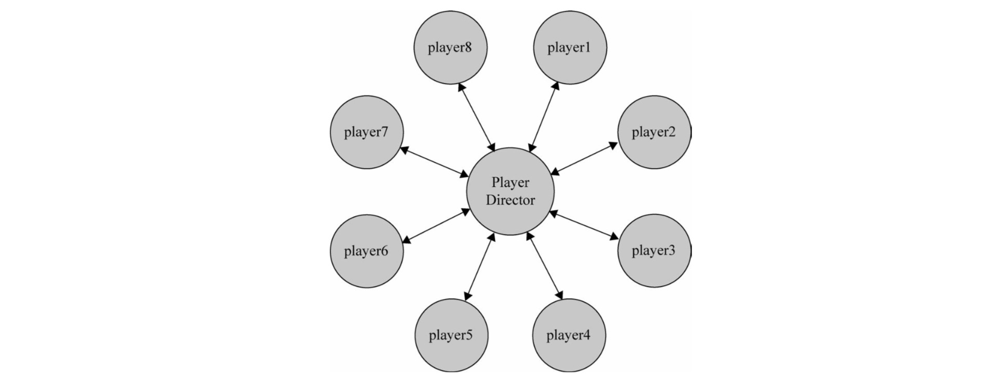

## 中介者模式

平时我们大概能记住 10 个朋友的电话、30 家餐馆的位置。在程序里，也许一个对象会和其他 10 个对象打交道，所以它会保持 10 个对象的引用。当程序的规模增大，对象会越来越多，它们之间的关系也越来越复杂，难免会形成网状的交叉引用。当我们改变或删除其中一个对象的时候，很可能需要通知所有引用到它的对象。这样一来，就像在心脏旁边拆掉一根毛细血管一般，即使一点很小的修改也必须小心翼翼。


面向对象设计鼓励将行为分布到各个对象中，把对象划分成更小的粒度，有助于增强对象的可复用性，但由于这些细粒度对象之间的联系激增，又有可能会反过来降低它们的可复用性。

**中介者模式的作用就是解除对象与对象之间的紧耦合关系。增加一个中介者对象后，所有的相关对象都通过中介者对象来通信，而不是互相引用，所以当一个对象发生改变时，只需要通知中介者对象即可。中介者使各对象之间耦合是松散，而且可以独立地改变他们之间的交互。中介者模式使网状的多对多关系变成了相对简单的一对多关系。**


在图1中，如果对象A发生了改变，则需要同时通知跟A发生引用关系的B、D、E、F这4个对象。

在图2中，使用中介者模式改进之后，A发生改变时则只需要通知这个中介者对象即可。

### 现实中的中介者

**机场指挥塔**

中介者也被称为调停者，我们想象一下机场的指挥塔，如果没有指挥塔的存在，每一架飞机要和方圆 100 公里内的所有飞机通信，才能确定航线以及飞行状况，后果是不可想象的。现实中的情况是，每架飞机都只需要和指挥塔通信。指挥塔作为调停者，知道每一架飞机的飞行状况，所以它可以安排所有飞机的起降时间，及时做出航线调整。

### 例子

使用js简单实现一个泡泡堂。在游戏之初只支持两个玩家同时进行对战。

先设定一个玩家构造函数，它有3个简单的原型方法：`Play.prototype.win`、`Play.prototype.lose`以及表示玩家死亡的`Play.prototype.die`。

```js
class Player {
  constructor(name) {
    this.name = name;
    this.enemy = null;  //敌人
  }
  win() {
    console.log(this.name + ' won ');
  }
  lose() {
    console.log(this.name + ' lost ');
  }
  die() {
    this.lose();
    this.enemy.win();
  }
}
//创建2个玩家对象
let player1 = new Player('皮蛋');
let player2 = new Player('小乖');
//给玩家相互设置敌人
player1.enemy = player2;
player2.enemy = player1;
//当玩家player1被泡泡炸死的时候，调用die
player1.die();
```

#### 为游戏增加队伍

现在我们改进一下游戏。因为玩家数量变多，用下面的方式来设置队友和敌人无疑很低效：

```js
player1.partners = [player1, player2, player3, player4];
player1.enemies = [player5, player6, player7, player8];

player5.partners = [player5, player6, player7, player8];
player1.enemies = [player1, player2, player3, player4];
```

所以我们需要定义一个数组players来保存所有的玩家，在创建玩家之后，循环players来给每个玩家设置队友和敌人：

```js
var players = [];
```

再改写构造函数 Player，使每个玩家对象都增加一些属性，分别是队友列表、敌人列表 、玩家当前状态、角色名字以及玩家所在的队伍颜色。

然后是win、lose、die方法

```js
class Player {
  constructor(name, teamColor) {
    this.partners = [];   //队友列表
    this.enemies = [];    //敌人列表
    this.state = 'live';  //玩家状态
    this.name = name;     //角色名字
    this.teamColor = teamColor;   //队伍颜色
  }
  //玩家团队胜利
  win() {
    console.log('Winner: ' + this.name);
  }
  //玩家团队失败
  lose() {
    console.log('loser: ' + this.name);
  }
  /*
        玩家死亡的方法要变得稍微复杂一点，我们需要在每个玩家死亡的时候，都遍历其他队友的生存状况，如果队友全部死亡，则这局游戏失败，同时敌人队伍的所有玩家都取得胜利
      */
  die() {
    let all_dead = true;
    this.state = 'dead';      //设置玩家状态为死亡
    //遍历队友列表
    for(let i=0, partner; partner=this.partners[i++];) {
      //如果还有一个队友没有死亡，则游戏还未失败
      if(partner.state !== 'dead') {
        all_dead = false;
        break;
      }
      //如果队友全部死亡
      if(all_dead === true) {
        this.lose();      //通知自己游戏失败
        //通知所有队友玩家游戏失败
        for(let i=0, partner; partner=this.partners[i++];) {
          partner.lose();
        }
        //通知所有敌人游戏胜利
        for(let i=0, enemy; enemy=this.enemies[i++];) {
          enemy.win();
        }
      }
    }
  }
}
//所有玩家
let players = [];
//最后定义一个工厂来创建玩家
function playerFactory(name, teamColor) {
  let newPlayer = new Player(name, teamColor);  //创建新玩家
  //通知所有的玩家，有新角色加入
  for(let i=0, player; player=players[i++];) {
    //如果是同一队的玩家
    if(player.teamColor === newPlayer.teamColor) {
      //相互添加到队友列表
      player.partners.push(newPlayer);  
      newPlayer.partners.push(player);
    } else {
      //相互添加到敌人列表
      player.enemies.push(newPlayer);  
      newPlayer.enemies.push(player);
    }
  }
  players.push(newPlayer);
  return newPlayer;
}
//红队:
var player1 = playerFactory( '皮蛋', 'red' ),
    player2 = playerFactory( '小乖', 'red' ), 
    player3 = playerFactory( '宝宝', 'red' ), 
    player4 = playerFactory( '小强', 'red' );
//蓝队:
var player5 = playerFactory( '黑妞', 'blue' ),
    player6 = playerFactory( '葱头', 'blue' ), 
    player7 = playerFactory( '胖墩', 'blue' ), 
    player8 = playerFactory( '海盗', 'blue' );
//让红队玩家全部死亡:
player1.die(); 
player2.die(); 
player4.die(); 
player3.die();
```

当前做法就是上面图1的方式。问题是，每个玩家和其他玩家都是紧密耦合在一起的。

在这个例子中只创建了 8 个玩家，或许还没有对你产生足够多的困扰，而如果在一个大型网络游戏中，画面里有成百上千个玩家，几十支队伍在互相厮杀。如果有一个玩家掉线，必须从所有其他玩家的队友列表和敌人列表中都移除这个玩家。游戏也许还有解除队伍和添加到别的队伍的功能，红色玩家可以突然变成蓝色玩家，这就不再仅仅是循环能够解决的问题了。面对这样的需求，我们上面的代码可以迅速进入投降模式。

#### 用中介者模式改造泡泡堂游戏



1. 首先仍然是定义Player构造函数和player对象的原型方法，在player对象的这些原型方法中，不再负责具体的执行逻辑，而是把操作转交给中介者对象`playerDirector`。

```js
class Player {
  constructor(name, teamColor) {
    this.name = name;     //角色名字
    this.teamColor = teamColor;   //队伍颜色
    this.state = 'alive';   //玩家生存状态
  }
  win() {
    console.log(this.name + 'won');
  }
  lose() {
    console.log(this.name + 'lost');
  }
  //玩家死亡
  die() {
    this.state = 'dead';
    playerDirector.ReceiveMessage('playerDead', this);  //给中介者发送消息，玩家死亡
  }
  //移除玩家
  remove() {
    playerDirector.ReceiveMessage('removePlayer', this);  //给中介者发送消息，移除一个玩家
  }
  //玩家换队
  changeTeam(color) {
    playerDirector.ReceiveMessage('changeTeam', this.color);  //给中介者发送消息，玩家换队
  }
}
```

2. 再继续改写之前创建玩家对象的工厂函数

```js
let playerFactory = function(name, teamColor) {
  let newPlayer = new Player(name, teamColor);    //创造一个新的玩家对象
  playerDirector.ReceiveMessage('addPlayer', newPlayer);    //给中介者发送消息，新增玩家
  return newPlayer;
};
```

3. 最后实现这个中介者playerDirector对象。一般有两种方式：
   1. 利用发布-订阅模式，将playerDirector实现为订阅者，各player作为发布者，一旦player的状态发生改变，便推送消息给playerDirector，playerDirector处理消息后将反馈发送给其他player。
   2. 在 playerDirector 中开放一些接收消息的接口，各 player 可以直接调用该接口来给playerDirector 发送消息，player 只需传递一个参数给 playerDirector，这个参数的目的是使 playerDirector 可以识别发送者。同样，playerDirector 接收到消息之后会将处理结果反馈给其他 player。

这两种方式的实现没什么本质上的区别。

```js
class Player {
  constructor(name, teamColor) {
    this.name = name;     //角色名字
    this.teamColor = teamColor;   //队伍颜色
    this.state = 'alive';   //玩家生存状态
  }
  win() {
    console.log(this.name + 'won');
  }
  lose() {
    console.log(this.name + 'lost');
  }
  //玩家死亡
  die() {
    this.state = 'dead';
    playerDirector.ReceiveMessage('playerDead', this);  //给中介者发送消息，玩家死亡
  }
  //移除玩家
  remove() {
    playerDirector.ReceiveMessage('removePlayer', this);  //给中介者发送消息，移除一个玩家
  }
  //玩家换队
  changeTeam(color) {
    playerDirector.ReceiveMessage('changeTeam', this.color);  //给中介者发送消息，玩家换队
  }
}

//2. 创建玩家对象的工厂函数
let playerFactory = function(name, teamColor) {
  let newPlayer = new Player(name, teamColor);    //创造一个新的玩家对象
  playerDirector.ReceiveMessage('addPlayer', newPlayer);    //给中介者发送消息，新增玩家
  return newPlayer;
};

//3. 最后实现这个中介者playerDirector对象。
var playerDirector = (function() {
  let players = {},     //保存所有玩家
      operations = {};    //中介者可以执行的操作

  /****************新增一个玩家***************************/
  operations.addPlayer = function(player) {
    let teamColor = player.teamColor;   //玩家的队伍颜色
    players[teamColor] = players[teamColor] || [];    //如果该颜色的玩家还没有成立队伍，则新成立一个队伍
    players[teamColor].push(play);    //添加玩家进队伍
  };

  /****************移除一个玩家***************************/
  operations.removePlayer = function(player) {
    let teamColor = player.teamColor,   //玩家的队伍颜色
        teamPlayers = players[teamColor] || [];   //该队伍所有成员
    //遍历删除
    for(let i = teamPlayers.length-1; i>=0; i--) {
      if(teamPlayers[i] === player) {
        teamPlayers.splice(i, 1);
      }
    }
  }

  /****************玩家换队***************************/
  operations.changeTeam = function(player, newTeamColor) {
    operations.removePlayer( player );    // 从原队伍中删除
    player.teamColor = newTeamColor;      // 改变队伍颜色
    operations.addPlayer( player );       // 增加到新队伍中
  }

  /****************玩家死亡***************************/
  operations.playerDead = function( player ){
    let teamColor = player.teamColor,
        teamPlayers = players[teamColor];   //玩家所在队伍

    let all_dead = true;

    for(let i=0, player; player=teamPlayers[i++];) {
      if(player.state !== 'dead') {
        all_dead = false;
        break;
      }
    }
    //全部死亡
    if(all_dead === true) {
      for(let i=0, player; player=teamPlayers[i++];) {
        player.lose();    //本队所有玩家lose
      }

      for(let color in players) {
        if(color !== teamColor) {
          let teamPlayers = players[color];   //其他队伍的玩家
          for(let i=0, player; player=teamPlayers[i++];) {
            player.win();   //其他队伍所有玩家win
          }
        }
      }
    }
  };

  let ReceiveMessage = function() {
    let message = Array.prototype.shift.call(arguments);    //arguments的第一个参数为消息名称
    operations[message].apply(this, arguments);
  };

  return {
    ReceiveMessage
  }
})();

//红队：
let player1 = playerFactory('皮蛋', 'red' ),
    player2 = playerFactory('小乖', 'red' ),
    player3 = playerFactory('宝宝', 'red' ),
    player4 = playerFactory('小强', 'red' ),
// 蓝队:
var player5 = playerFactory('黑妞', 'blue'),
		player6 = playerFactory('葱头', 'blue'),
    player7 = playerFactory('胖墩', 'blue'),
    player8 = playerFactory('海盗', 'blue');

player1.die(); 
player2.die(); 
player3.die(); 
player4.die();
```


### 小结

中介者模式是迎合迪米特法则的一种实现。迪米特法则也叫最少知识原则，是指一个对象应该尽可能少地了解另外的对象(类似不和陌生人说话)。如果对象之间的耦合性太高，一个对象发生改变之后，难免会影响到其他的对象。而在中介者模式里，对象之间几乎不知道彼此的存在，他们只能通过中介者对象来互相影响对方。

因此，中介者模式使各个对象之间得以解耦，以中介者和对象之间的一对多关系取代了对象之间的网状多对多关系。各个对象只需关注自身功能的实现，对象之前的交互关系交给了中介者对象来实现和维护。

缺点：中介者对象也存在一些缺点。其中，最大的缺点是系统中会新增一个中介者对象，因为对象之间交互的复杂性，转移成了中介者对象的复杂性，使得中介者对象经常是巨大的。中介者对象自身往往就是一个难以维护的对象。

我们都知道，毒贩子虽然使吸毒者和制毒者之间的耦合度降低，但毒贩子也要抽走一部分利润。同样，在程序中，中介者对象要占去一部分内存。而且毒贩本身还要防止被警察抓住，因为它了解整个犯罪链条中的所有关系，这表明中介者对象自身往往是一个难以维护的对象。

一般来说，如果对象之间的复杂耦合确实导致调用和维护出现了困难，而且这些耦合度随项目的变化呈指数增长曲线，那我们就可以考虑用中介者模式来重构代码。