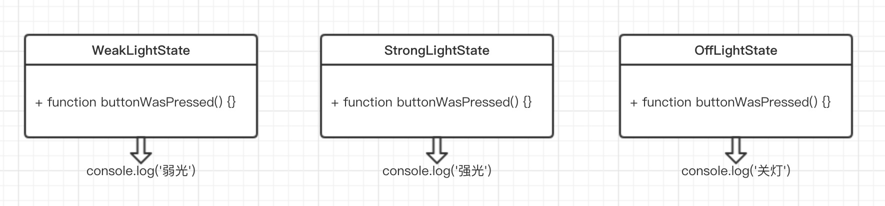

### 状态模式

状态模式的关键是区分事物内部的状态，事物内部状态的 改变往往会带来事物的行为改变。

#### 初始状态模式

比如有一个开关控制电灯，同一个开关按钮，在不同的状态下，表现出来的行为是不一样的：

1. 电灯开着的时候，按下开关，电灯关闭
2. 电灯关着的时候，按下开关，电灯打开

现在用代码实现：

```js
var Light = function() {
  this.state = 'off';		//给电灯设置初始状态off
  this.button = null;		//电灯开关按钮
}
//init方法创建一个真实的button节点
Light.prototype.init = function() {
  var button = document.createElement('button'),
      self = this;
  
	button.innerHTML = '开关';
  this.button = document.body.appendChild(button);
  this.button.onclick = function() {
    self.buttonWasPressed();
  }
}
//开关按下之后的所有行为
Light.prototype.buttonWasPressed = function() {
  if(this.state === 'off') {
    console.log('开灯');
    this.state = 'on';
  } else if(this.state === 'on') {
    console.log('关灯');
    this.state = 'off';
  }
}

var light = new Light();
light.init();
```

但有时也许一个新的电灯的转态是：1. 第一次是微光，2. 第二次是强光， 3. 第三次是关灯

```js
Light.prototype.buttonWasPressed = function() {
  if(this.state === 'off') {
    console.log('微光');
    this.state = 'weakLight';
  } else if(this.state === 'weakLight') {
    console.log('强光');
    this.state = 'strongLight';
  } else if(this.state === 'strongLight') {
    console.log('关灯');
    this.state = 'off';
  }
}
```

现在反例先告一段落，上述程序存在的缺点：

- buttonWasPressed方法违反开发-封闭原则，每次新增或修改light的状态，都需要改动buttonWasPressed方法中的代码，使该方法成为一个不稳定的方法

- 所有跟状态有关的行为都封装在了buttonWasPressed方法里，如果后续又增加了新的状态写入该方法，那么该方法将会膨胀到什么地步。
- 状态的切换非常不明显，我们没有办法一目了然的明白电灯一共有多少种状态，除非耐心读完buttonWasPressed方法里的所有代码。
- 状态之间的切换关系，不过是往buttonWasPressed方法里堆砌`if`、`else`语句，增加或修改一个状态可能需要改变若干个操作，会存在大量的`if`、`else`语句，使buttonWasPressed更加的难以阅读和维护。

#### 状态模式改进电灯程序

通常我们谈到封装，一般都会优先封装对象的行为，而不是对象的状态。但在状态模式中刚好相反，**状态模式的关键是把事物的每种状态都封装成单独的类，跟此种状态有关的行为都被封装在这个类的内部**，所以button被按下的时候，只需要在上下文中，把这个请求委托给当前的状态对象即可，该状态对象会负责渲染它自身的行为。



同时将各自状态的切换规则分布在状态类中（写在各自的buttonWasPressed方法中）。

```js
//电灯的各种状态类

// OffLightState
class OffLightState {
  constructor(light) {
    this.light = light;
  }
  buttonWasPressed() {
    console.log('弱光');		//offLightState对应的行为
    this.light.setState(this.light.weakLightState);		//切换状态到weakLightState
  }
}

//WeakLightState
class WeakLightState {
  constructor(light) {
    this.light = light;
  }
  buttonWasPressed() {
    console.log('强光');		//weakLightState对应的行为
    this.light.setState(this.light.strongLightState);		//切换状态到strongLightState
  }
}

//StrongLightState
class StrongLightState {
  constructor(light) {
    this.light = light;
  }
  buttonWasPressed() {
    console.log('关灯');		//strongLightState对应的行为
    this.light.setState(this.light.offLightState);		//切换状态到offLightState
  }
}
```

```js
//Light

class Light {
  constructor() {
    this.offLightState = new OffLightState(this);
    this.weakLightState = new WeakLightState(this);
    this.strongLightState = new StrongLightState(this);
    this.button = null;
  }
  init() {
    var button = document.createElement('button'),
        self = this;
    this.button = document.body.appendChild(button);
    this.button.innerHTML = '开关';
    
    this.currState = this.offLightState;		//设置当前状态
    
    this.button.onclick = function() {			//点击按钮就触发当前状态上的行为
      self.currState.buttonWasPressed();
    }
  }
  setState(newState) {		//设置新状态
    this.currState = newState;
  }
}
var light = new Light();
light.init();
```

```js
//如果还要加入新的状态时，只要添加新的状态类

//StrongLightState
class SuperStrongLightState {
  constructor(light) {
    this.light = light;
  }
  buttonWasPressed() {
    console.log('关灯');		//strongLightState对应的行为
    this.light.setState(this.light.offLightState);		//切换状态到offLightState
  }
}

//在Light类的构造函数中增加
constructor() {
  this.offLightState = new OffLightState(this);
  this.weakLightState = new WeakLightState(this);
  this.strongLightState = new StrongLightState(this);
  this.superStrongLightState = new SuperStrongLightState(this);		//新增superStrongLightState状态
  this.button = null;
}
```

最后状态之间的切换规则是：A＞B＞C＞A

在JavaScript设计模式与开发实践一书中，还有一个更加复杂、有趣的文件上传例子，不过编写的过程都类似，可以自行查看。

#### 状态模式的优缺点

优点：

- 状态模式定义了状态与行为之间的关系，并将他们封装在一个类里。通过增加新的状态类，很容易增加新的状态和转换。
- 避免Context无限膨胀，状态切换的逻辑被分布在状态类中，也去掉了Context中原本过多的条件分支。
- 用对象代替字符串来记录当前状态，使得状态的切换更加一目了然。
- Context中的请求动作和状态类中封装的行为可以非常容易地独立变化而互不影响。

缺点：

- 状态模式的缺点是会在系统中定义许多状态类，编写20个状态类是一项枯燥乏味的工作，而且系统中会因此而增加不少对象。
- 由于逻辑分散在状态类中，虽然避开了不受欢迎的条件分支语句，但也造成了逻辑分散的问题，我们无法在一个地方就看出整个状态机的逻辑。

#### 状态模式和策略模式的关系

状态模式和策略模式像一对双胞胎，它们都封装了一系列的算法或行为，它们的类图看起来几乎一模一样，但在意图上有很大不同，因此它们是两种迥然不同的模式。

策略模式和状态模式的相同点是，它们都有一个上下文、一些策略或者状态类，上下文把请求委托给这些类来执行。

**它们之间的区别是策略模式中的各个策略类之间是平等又平行的，它们之间没有任何联系，所以客户必须熟知这些策略类的作用，以便客户可以随时主动切换算法；而在状态模式中，状态和状态对应的行为是早已被封装好的，状态之间的切换也早被规定完成，"改变行为"这件事情发生在状态模式内部。对客户来说，并不需要了解这些细节。这正是状态模式的作用所在。**

#### JavaScript版本的状态机

前面的例子都是模拟传统面向对象语言的状态模式实现，我们为每种状态都定义一个状态子类，然后在Context中持有这些状态对象的引用，以便把currentState设置为当前的状态对象。

状态模式是状态机的实现之一，在JavaScript这种"无类"语言中(ES6中已经有了)，没有规定让状态对象一定要从类中创建而来。另外一点，JavaScript可以非常方便使用委托技术，并不需要事先让一个对象持有另一个对象。可以使用`Function.prototype.call`方法直接把请求委托给某个字面量对象来执行。

```js
var Ligth = function() {
  this.currState = FSM.off;			//设置当前状态
  this.button = null;
}
Light.prototype.init = function() {
   var button = document.createElement('button'),
        self = this;
    this.button.innerHTML = '已关灯';
    this.button = document.body.appendChild(button);
  	
  	this.button.onclick = function() {
      self.currState.buttonWasPressed.call(self);  //把请求委托给FSM状态机
    }
}

var FSM = {
  off: {
    buttonWasPressed() {
      console.log('关灯');
      this.button.innerHTML = '下一次按我是开灯';
      this.currState = FSM.on;
    }
  },
  on: {
    buttonWasPressed() {
      console.log('开灯');
      this.button.innerHTML = '下一次按我是关灯';
      this.currState = FSM.off;
    }
  }
}
var light = new Light();
light.init();
```


### 小结

其实总的来说，状态模式其实就是：

1. Context中要绑定一个当前状态对象，
2. 而该状态对象中存在状态信息和行为方法，
3. 行为方法中有执行对其他状态对象的操作，
4. 当点击按钮时，触发当前状态对象的行为方法，通过行为方法执行其他操作和得到新的状态对象。