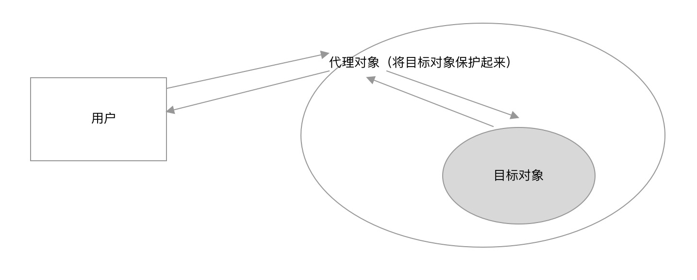

### 代理模式

代理模式是为一个对象提供一个代用品或占位符，以便控制对它的访问。

代理模式是一种非常有意义的模式，在生活中可以找到很多代理模式的场景。比如，明星都有经纪人作为代理。如果想请明星来办一场商业演出，只能联系他的经纪人。经纪人会把商业演出的细节和报酬都谈好之后，再把合同交给明星签。

代理模式的关键是，当客户不方便直接访问一个对象或者不满足需要的时候，提供一个替身对象来控制对这个对象的访问，客户实际上访问的是替身对象。替身对象对请求做出一些处理之后，再把请求转交给本体对象。

- 使用者无权访问目标对象
- 中间加代理，通过代理做授权和控制



c场景

1. 反向代理
2. 明星和经纪人
3. 网页事件代理
4. ES6 Proxy
5. ······

##### 例子1

```js
class ReadImg {
  constructor(fileName) {
    this.fileName = fileName;
    this.loadFromDisk();    //初始化即从硬盘中加载，模拟
  }
  display() {
    console.log('display...' + this.fileName);
  }
  loadFromDisk() {
    console.log('loading...' + this.fileName);
  }
}
class ProxyImg {
  constructor(fileName) {
    this.realImg = new ReadImg(fileName);
  }
  display() {
    this.realImg.display()
  }
}
let proxyImg = new ProxyImg('1.png');
proxyImg.display();
```

##### 例子2

网页事件代理，冒泡。不直接访问子节点的事件，通过父节点的事件来访问

```html
<ul>
  <li>1</li>
  <li>2</li>
  <li>3</li>
</ul>

<script>
  let ul = document.querySelector('ul');
  ul.addEventListener('click', function(e) {
    var target = e.target;
    if(target.nodeName === 'A') {
       alert(1)
    }
  })
</script>
```

##### 例子3

做舔狗

```js
//花
function Flower() {};
//小明
const xiaoming = {
  sendFlower( target ){
		var flower = new Flower();
		target.receiveFlower( flower ); 
  }
} 
//女神A
const A = {
	receiveFlower( flower ){
		console.log( '收到花 ' + flower );
  }
};
//小明直接送花
xiaoming.sendFlower( A );
```

通过B朋友送花

```js
//花
var Flower = function(){};
//小明
const xiaoming = {
	sendFlower( target){ 
    var flower = new Flower();
		target.receiveFlower( flower ); 
  }
};
//各自的朋友B(代理)
const B = {
  receiveFlower( flower ){
    //转交给A。    可以做一些判断在A女神心情好的时候转交，
    A.receiveFlower( flower );
  }
}
//女神A
const A = {
  receiveFlower: function( flower ){
    console.log( '收到花 ' + flower ); 
  }
};
//小明将花交给B
xiaoming.sendFlower( B );
```

即

```js
var a = {
  show(target) {
    target.show()
  }
}
var b = {
  show(target) {
    c.show();
  }
}
var c = {
  show(target) {
    target.show()
  }
}
a.show(b)			//a不能直接调用c的show方法，只能通过b来调用
```

##### 4例子

明星和经纪人

```js
//明星
let star = {
  name: '张xx',
  age: 25,
  phone: '13902901111'
}

//经纪人
let agent = new Proxy(star, {
  get(target, key) {
    if (key === 'phone') {
      //返回经纪人自己的电话
      return '16899997777'
    }
    if(key === 'price') {
      //明星不报价，经纪人报价
      return 120000
    }
    return target[key];
  },
  set(target, key, val) {
    console.log(target)           //{name: "张xx", age: 25, phone: "13902901111"}
    if(key === 'customPrice') {
      if(val < 100000) {
        //最低10w
        throw new Error('价格太低')
      } else {
        target[key] = val;
        return true;
      }
    }
  }
});

console.log(agent.name);      //张xx
console.log(agent.age);       //25
console.log(agent.phone);     //16899997777
console.log(agent.price);     //120000

agent.customPrice = 150000;
console.log('star:', star);       //{name: "张xx", age: 25, phone: "13902901111", customPrice: 150000}
console.log('agent:', agent);     //Proxy {name: "张xx", age: 25, phone: "13902901111", customPrice: 150000}
console.log('agent.customPrice', agent.customPrice);    //agent.customPrice 150000
```

#### 保护代理和虚拟代理

像上面小明送花给A，需要B代理的例子中，我们可以从中找到两种代理模式的身影。代理B可以帮助A过滤掉一些请求，比如送花的人中年龄太大或者没有宝马的，这种请求就可以直接在代理B处被拒绝掉。这种代理叫做**保护代理**。A和B一个充当白脸，一个充当黑脸。白脸A继续保持女神形象，不希望直接拒绝任何人，于是找了黑脸B来控制对A的访问。

另外，假设花价格不菲，`new Flower()`也是一个代价昂贵的操作，那么我们可以把`new Flower()`的操作交给代理B去执行，代理B会选择在A心情好的时候再执行 `new Flower()`，这是代理模式的另一种形式，叫做**虚拟代理**，虚拟代理把一些开销很大的对象，延迟到真正需要它的时候去创建。

```js
var B = {
  receiveFlower() {
    A.listenHaoXinQing(function() {		//监听A的好心情
      var flower = new Flower()				//延迟创建flower对象
      A.receiveFlower(flower)
    })
  }
}
```

##### 虚拟代理实现图片预加载

在Web开发中，图片预加载是一种常用的技术，如果直接给某个``标签节点设置`src`属性，由于图片过大或者网络不佳，图片的位置往往有段时间会是一片空白。常见的做法是先用一张loading图片占位(或直接用css写loading)，然后用异步的方式加载图片，等图片加载好了再把它填充到img节点里，这种场景就很适合使用虚拟代理。

首先创建一个普通的本体对象，这个对象负责往页面中创建一个``标签，并且提供一个对外的`setSrc`接口，外界调用这个接口，便可以设置`src`属性。

```js
var myImage = (function() {
  let imgNode = document.createElement('img');	//或new Image()
  document.body.appendChild(imgNode);
  return {
    setSrc(src) {
      imgNode.src = src;
    }
  }
})()
myImage.setSrc('外部图片链接')
```

然后创建一个代理对象proxyImage，通过这个代理对象，在图片被真正加载好之前，页面中将出现一张占位的加载图，来提示用户图片正在加载。

```js
var myImage = (function() {
  let imgNode = document.createElement('img');	//或new Image()
  document.body.appendChild(imgNode);
  return {
    setSrc(src) {
      imgNode.src = src;
    }
  }
})()
var proxyImage = (function() {
  let img = new Image();
  img.onload = function() {
    myImage.setSrc(this.src)
  }
  return {
    setSrc(src) {
      myImage.setSrc('本地图片或用css制作加载动画');
      img.src = src;
    }
  }
})()
proxyImage.setSrc('要加载的图片链接');
```

现在我们通过proxyImage间接地访问myImage。

#### 缓存代理

缓存代理可以为一些开销大的运算结果提供暂时的存储，在下次运算时，如果传递进来的参数跟之前一致，则可以直接返回前面存储的运算结果。

```js
//先创建一个用于求乘积的函数:
var mult = function(){ 
  console.log( '开始计算乘积' );
  var a = 1;
  for(var i = 0, l=arguments.length; i<l; i++) {
    a = a * arguments[i];
  }
  return a;
}
mult(2, 3);    //6
mult(2, 3, 4); //24

//加入缓存代理函数
var proxyMult = (function() {
  var cache = {};
  return function() {
    var args = Array.prototype.join.call(arguments, ',');
    if(args in cache) {			//如果在缓存中则直接调用
      return cache[args];
    }
    return cache[args] = mult.apply(this, arguments);
  }
})();
proxyMult(1, 2, 3, 4);
proxyMult(1, 2, 3, 4);
```

#### 用高阶函数动态创建代理

通过传入高阶函数这种更加灵活的方式，可以为各种计算方法创建缓存代理。

将方法被当作参数传入一个专门用于创建缓存代理的工厂中， 这样一来，我们就可以为乘法、加 法、减法等创建缓存代理。

```js
/**************** 计算乘积 *****************/
var mult = function(){
  var a = 1;
  for ( var i = 0, l = arguments.length; i < l; i++ ){
    a = a * arguments[i];
  }
  return a;
};
/**************** 计算加和 *****************/
var plus = function(){
  var a = 0;
  for ( var i = 0, l = arguments.length; i < l; i++ ){
    a = a + arguments[i];
  }
  return a;
};
/**************** 创建缓存代理的工厂 *****************/
var createProxyFactory = function( fn ){
   var cache = {};
  return function(){
    var args = Array.prototype.join.call( arguments, ',' );
    if ( args in cache ){
      return cache[ args ];
    }
		return cache[ args ] = fn.apply( this, arguments );
 };
  
  var proxyMult = createProxyFactory( mult ),
      proxyPlus = createProxyFactory( plus );

  alert ( proxyMult( 1, 2, 3, 4 ) ); 	// 输出:24
  alert ( proxyMult( 1, 2, 3, 4 ) ); 	// 输出:24
  alert ( proxyPlus( 1, 2, 3, 4 ) ); 	// 输出:10
  alert ( proxyPlus( 1, 2, 3, 4 ) );	// 输出:10
```

#### 设计原则验证

- 代理类和目标类分离，隔离开目标类和使用者
- 符合开放封闭原则


### 代理&适配器&装饰模式对比

1. 代理模式vs适配器模式
   1. 适配器模式：提供一个不同的接口(如不同版本的插头)
   2. 代理模式：提供一模一样的接口

2. 代理模式vs装饰器模式
   1. 装饰器模式：扩展功能，原有功能不变且可直接使用。
   2. 代理模式：显示原有功能，但是经过限制或者阉割之后的

### 小结

代理模式包括许多小分类，在 JavaScript 开发中最常用的是虚拟代理和缓存代理。虽然代理 模式非常有用，但我们在编写业务代码的时候，往往不需要去预先猜测是否需要使用代理模式。 当真正发现不方便直接访问某个对象的时候，再编写代理也不迟。 