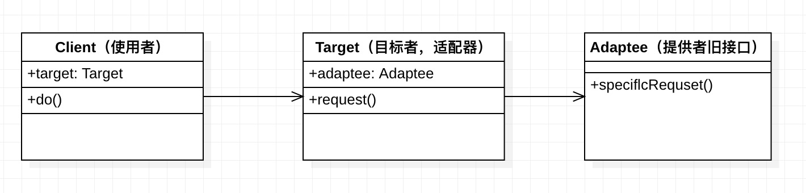

### 适配器模式

- 旧接口格式和使用者不兼容
- 中间加一个适配转换接口

生活中的适配器，比如：插头转换器、USB转接口、type-c转接口等。

#### UMI图



```js
//提供者，旧接口
class Adaptee {
  specificRequest() {
    return '德国标准插头'
  }
}
//适配器
class Target {
  constructor() {
    this.adaptee = new Adaptee();
  }
  request() {
    let info = this.adaptee.specificRequest();
    return `${info} - 转换器 - 中国标准插头`
  }
}
//测试
let target = new Target();
let res = target.request();
console.log(res);   //德国标准插头 - 转换器 - 中国标准插头
```

#### 适配器模式的应用

如果现有的接口已经能够正常工作，那我们就永远不会用上适配器模式。适配器模式是一种“亡羊补牢”的模式，没有人会在程序的设计之初就使用它。因为没有人可以完全预料到未来的事情，也许现在好好工作的接口，未来的某天却不再适用于新系统，那么我们可以用适配器模式把旧接口包装成一个新的接口，使它继续保持生命力。

- 封装旧接口
- vue computed

封装旧接口

```js
//自己封装的ajax，使用方式如下：
ajax({
  url: '',
  type: '',
  dataType: '',
  data: {},
}).done(function(){})
//因为历史原因，代码中全都是：$.ajax({...})

//做一层适配器
let $ = {
  ajax(options) {
    return ajax(options);
  }
}
```

vue computed

```js
new Vue({
  el: '#example',
  data: {
    message: 'hello'
  },
  computed: {
    reversedMessage() {
      return this.message.split('').reverse().join('')
    }
  }
})
```

#### 设计原则验证

- 将旧接口和使用者进行分离
- 符合开放封闭原则


### 小结

适配器模式是一对相对简单的模式。有些模式跟适配器模式的结构非常相似，比如装饰者模式、代理模式和外观模式。这几种模式都属于"包装模式"，都是由一个对象来包装另一个对象。区别他们的关键仍然是模式的意图。

- **适配器模式主要用来解决两个已有接口之间不匹配的问题**，它不考虑这些接口是怎样实现的，也不考虑他们将来可能会如何演化。适配器模式不需要改变已有的接口，就能够使他们协同作用。
- 装饰器模式和代理模式也不会改变原有对象的接口，但**装饰者模式的作用是为了给对象增加功能**。装饰者模式常常形成一条长的装饰链，而适配器模式通常只包装一次。**代理模式是为了控制对对象的访问**，通常也只包装一次。
- 外观模式的作用倒是和适配器比较相似，有人把外观模式看成一组对象的适配器，但外观模式最显著的特点是定义了一个新街口。