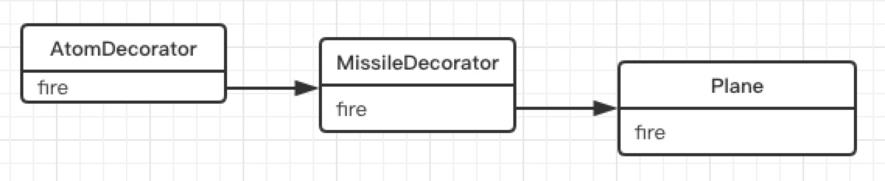

### 装饰器模式

在传统的面向对象语言中，给对象添加功能常常使用继承的方式，但是继承的方式并不灵活，还会带来许多问题:

1. 一方面会导致超类和子类之间存在强耦合性，当超类改变时，子类也会随之改变。
2. 另一方面，继承这种功能复用方式通常被称为“白箱复用”，“白箱”是相对可见性而言的，在继承方式中，超类的内部细节是对子类可见的，继承常常被认为破坏了封装性。
3. 使用继承还会带来另外一个问题，在完成一些功能复用的同时，有可能创建出大量的子类，使子类的数量呈爆炸性增长。

装饰者模式能够在不改变对象自身的基础上，在程序运行期间给对象动态地添加职责。跟继承相比，装饰者是一种更轻便灵活的做法，这是一种“即用即付”的方式。

- 为对象添加新功能
- 不改变其原有的结构和功能

#### 模拟传统面向对象语言的装饰者模式

```js
//普通飞机
var Plane = function(){}
Plane.prototype.fire = function(){ 
  console.log( '发射普通子弹' );
}
//增加两个装饰类，分别是导弹和原子弹。普通飞机升级
var MissileDecorator = function( plane ){ 
  this.plane = plane;
}
MissileDecorator.prototype.fire = function(){ 
  this.plane.fire();					//调用 plane 对象的 fire 方法
	console.log( '发射导弹' );
}
var AtomDecorator = function( plane ){ 
  this.plane = plane;
}
AtomDecorator.prototype.fire = function(){ 
  this.plane.fire();				//调用 plane 对象的 fire 方法
	console.log( '发射原子弹' );
}

var plane = new Plane();
plane = new MissileDecorator( plane );
plane = new AtomDecorator( plane );
plane.fire();		// 分别输出: 发射普通子弹、发射导弹、发射原子弹
```

导弹类和原子弹类的构造函数都接受参数 plane 对象，并且保存好这个参数，在它们的 fire 方法中，除了执行自身的操作之外，还调用 plane 对象的 fire 方法。 

这种给对象动态增加职责的方式，并没有真正地改动对象自身，而是将对象放入另一个对象之中，这些对象以一条链的方式进行引用，形成一个聚合对象。这些对象都拥有相同的接口(fire方法)，当请求达到链中的某个对象时，这个对象会执行自身的操作，随后把请求转发给链中的下一个对象。

因为装饰者对象和它所装饰的对象拥有一致的接口，所以它们对使用该对象的客户来说是透明的，被装饰的对象也并不需要了解它曾经被装饰过，这种透明性使得我们可以递归地嵌套任意多个装饰者对象。



装饰者模式将一个对象嵌入另一个对象之中，实际上相当于这个对象被另一个对象包装起来，形成一条包装链。请求随着这条链依次传递到所有的对象，每个对象都有处理这条请求的机会。

#### 回到JavaScript的装饰者

JavaScript 语言动态改变对象相当容易，我们可以直接改写对象或者对象的某个方法，并不需要使用“类”来实现装饰者模式，代码如下:

```js
var plane = {
	fire: function(){
		console.log( '发射普通子弹' ); 
  }
}
var missileDecorator = function(){ 
  console.log( '发射导弹' );
}
var atomDecorator = function(){ 
  console.log( '发射原子弹' );
}

var fire1 = plane.fire;
plane.fire = function(){ 
  fire1();
	missileDecorator(); 
}

var fire2 = plane.fire;
plane.fire = function(){ 
  fire2();
	atomDecorator(); 
}

plane.fire();		// 分别输出: 发射普通子弹、发射导弹、发射原子弹
```

#### 装饰函数

在 JavaScript 中可以很方便地给某个对象扩展属性和方法，但却很难在不改动某个函数源代码的情况下，给该函数添加一些额外的功能。在代码的运行期间，我们很难切入某个函数的执行环境。

要想为函数添加一些功能，最简单粗暴的方式就是直接改写该函数，但这是最差的办法，直接违反了开放封闭原则:

```js
var a = function(){ 
  alert (1);
}
//改成
var a = function(){ 
  alert (1);
  alert (2);
}
```

现在需要一个办法，在不改变函数源代码的情况下，能给函数增加功能，这正是开放封闭原则给我们指出的光明道路。

```js
var a = function() {
  alert (1);
}
var _a = a;
var a = function() {
  _a();
  alert (2);
}
a();
```

#### 用AOP装饰函数

```js
Function.prototype.before = function(beforefn) {
  let __self = this;		//保存原函数的引用
  return function() {		// 返回包含了原函数和新函数的"代理"函数
    // 执行新函数，且保证 this 不被劫持，新函数接受的参数。也会被原封不动地传入原函数，新函数在原函数之前执行
    beforefn.apply( this, arguments ); 
    // 执行原函数并返回原函数的执行结果，并且保证 this 不被劫持
    return __self.apply( this, arguments );
  }
}
Function.prototype.after = function( afterfn ){
  var __self = this;
  return function(){
  	var ret = __self.apply( this, arguments ); 
    afterfn.apply( this, arguments );
  	return ret;
  }
}
/*
__self: document.getElementById
beforefn.apply( this, arguments )的this： document
__self.apply( this, arguments )的this： document
*/
document.getElementById = document.getElementById.before(function () {
  alert(1);
});
var button = document.getElementById( 'button' );
```

#### AOP的应用实例

1. 例子1：数据统计上报

比如一个页面中有一个登录button，点击这个button会弹回登录浮层，与此同时要进行数据上报，来统计有多少用户点击了这个登录button。

```html
<button tag="login" id="button">点击打开登录浮层</button>
```

```js
let showLogin = function() {
  console.log('打开登录浮层');
  log(this.getAttribute('tag'));
}
let log = function(tag) {
  console.log('上报标签为：' + tag);
  // (new Image).src = 'http:// xxx.com/report?tag=' + tag;   // 真正的上报代码略
}
document.getElementById('button').onclick = showLogin;
```

我们看到在showLogin函数里，既要负责打开登录浮层，又要负责数据上报，这是两个层面的功能，在此却被耦合在一个函数里。使用AOP分离之后，如下：

```js
Function.prototype.after = function(afterfn) {
  let __self = this;
  return function() {
    let ret = __self.apply(this, arguments);
    console.log(this, ret);
    afterfn.apply(this, arguments);
    return ret;
  }
}
let showLogin = function() {
  console.log('打开登录浮层');
}
let log = function() {
  console.log('上报标签为：' + this.getAttribute('tag'));
}
showLogin = showLogin.after(log);			//打开登录浮层之后上报数据
document.getElementById('button').onclick = showLogin;
```

2. 例子2：用AOP动态改变函数的参数，比如一个封装好的ajax方法，突然在项目中说需要都带上token，但又不想破坏原ajax方法，为了改变函数的参数，可以使用如下方法：

```js
 Function.prototype.before = function(beforefn) {
   let __self = this;
   return function() {
     beforefn.apply(this, arguments);
     return __self.apply(this, arguments);
   }
 }
let func = function(param) {
  console.log(param)
}
/*
	通过beforefn.apply(this, arguments)函数之后，{a: 'a'}变为了{a: 'a', b: 'b'}
*/
func = func.before(function(param) {
  param.b = 'b';
}) 
func({a: 'a'})
```

3. 例子3：插件式的表单验证

```html
用户名:<input id="username" type="text"/>
密码: <input id="password" type="password"/>
<input id="submitBtn" type="button" value="提交">
```

```js
var username = document.getElementById( 'username' ),
    password = document.getElementById( 'password' ), 
    submitBtn = document.getElementById( 'submitBtn' );

var formSubmit = function(){
  if ( username.value === '' ){
    return alert ( '用户名不能为空' ); 
  }
  if ( password.value === '' ){
    return alert ( '密码不能为空' );
  }
  var param = {
    username: username.value, 
    password: password.value
  }
  ajax( 'http:// xxx.com/login', param );
}
submitBtn.onclick = function(){ 
  formSubmit();
}
```

formSubmit函数在此处承担了两个职责，除了提交ajax请求之外，还要验证用户输入的合法性。这种代码一来回造成函数臃肿，职责混乱，二来谈不上任何可复用性。

改进1：

```js
var username = document.getElementById( 'username' ),
    password = document.getElementById( 'password' ), 
    submitBtn = document.getElementById( 'submitBtn' );
let validata = function() {
  if(username.value === '') {
    alert('用户名不能为空');
  }
  if(password.value === '') {
    alert('密码不能为空');
    return false;
  }
}
var formSubmit = function() {
  if(validata() === false) {    //校验未通过
    return;
  }
  var param = {
    username: username.value, 
    password: password.value
  }
  // ajax( 'http:// xxx.com/login', param );
  }
submitBtn.onclick = function(){ 
  formSubmit();
}
```

现在的代码已经有了一些改进，我们把校验的逻辑都放到了validate函数中，但formSubmit函数的内部还是要计算validate函数的返回值，因为返回值的结果表明了是否通过校验。

改进2：使validate和formSubmit完全分离开来。

```js
var username = document.getElementById( 'username' ),
    password = document.getElementById( 'password' ), 
    submitBtn = document.getElementById( 'submitBtn' );
Function.prototype.before = function(beforefn) {
  let __self = this;
  return function() {
    if(beforefn.apply(this, arguments) === false) {
      //beforefn返回false的情况直接return,不再执行后面的原函数
      return;
    }
    return __self.apply(this, arguments);
  }
}
let validata = function() {
  if(username.value === '') {
    alert('用户名不能为空');
  }
  if(password.value === '') {
    alert('密码不能为空');
    return false;
  }
}
var formSubmit = function() {
  var param = {
    username: username.value, 
    password: password.value
  }
  // ajax( 'http:// xxx.com/login', param );
  }
formSubmit = formSubmit.before(validata);
submitBtn.onclick = function(){ 
  formSubmit();
}
```

另外，这种装饰方式也叠加了函数的作用域，如果装饰的链条过长，性能上也会受到一些影响。

#### ES7中的装饰器

装饰器只能用于类和类的方法，不能用于函数，因为存在函数提升。

1. es7装饰器

```js
@testDec
class Demo {
  
}
function testDec(target) {
  target.isDec = true;
}
alert(Demo.isDec)    //true
```

2. 装饰类

```js
//装饰器的原理
@decorator
class A {}

//等同于
class A {}
A = decorator(A) || A;

//可以加参数        testDec(true)执行，@装饰器符号也执行函数
function testDec(isDec) {
  return function(target) {
    target.isDec = isDec
  }
}
@testDec(true)
class Demo {}
alert(Demo.isDec)    //true
```

3. 装饰类 - mixin 示例

```js
function mixins(...list) {
  return function(target) {
    Object.assign(target.prototype, ...list)			//给MyClass.prototype添加方法
  }
}

const Foo = {
  foo() { alert('foo') }
}

@mixins(Foo)
class MyClass {}

let obj = new MyClass();
obj.foo() 	// 'foo'
```

4. 装饰方法

```js
//例子1
function readonly(target, name, descriptor) {
  /*
  	target：类名
  	name：属性名
  	descriptor 属性描述对象 Object.defineProperty中会用到，原来的值如下：
  	{
  		value: xxx,
  		enumerable: false,
  		configurable: true,
  		writable: true
  	}
  */
  descriptor.writable = false;
  return descriptor;
}

class Person {
  constructor() {
    this.first = 'A';
    this.last = 'B';
  }
  //装饰方法
  @readonly
  name() {
    return `${this.first} ${this.last}`
  }
}
let p = new Person();
console.log(p.name());   
p.name = function(){}  	//报错，因为name这里是只读属性
```

```js
//例子2
function log(target, name, descriptor) {
  let oldValue = descriptor.value;
  //返回的是一个新函数，重新赋值了。
  descriptor.value = function() {
    console.log(`Calling ${name} with`, arguments);
    return oldValue.apply(this, arguments);
  }
  return descriptor;
}
class Math {
  @log
  add(a, b) {
    return a+b;
  }
}
const math = new Math();
const result = Math.add(2, 4); 	//执行add时， 会自动打印日志，因为有@log装饰器
console.log('result', result);
```

#### 设计原则验证

- 将现有对象和装饰器进行分离，两者独立存在
- 符合开放封闭原则

#### 装饰者模式和代理模式

这两种模式的结构看起来非常像，这两种模式都描述了怎么为对象提供一定程度上的间接引用，他们的实现部分都保留了对另一个对象的引用，并且向那个对象发送请求。

代理模式和装饰者模式最重要的区别在于他们的意图和设计目的。

代理模式的目的是：当直接访问本体不方便或不符合需要时，为这个本体提供一个替代者。本体定义了关键功能，而代
理提供或拒绝对它的访问，或者在访问本体之前做一些额外的事情。

装饰者模式的作用是：为对象动态加入行为。

换句话说，代理模式强调一种关系(Proxy 与它的实体之间的关系)，这种关系可以静态的表达，也就是说，这种关系在一开始就可以被确定。而装饰者模式用于一开始不能确定对象的全部功能时。代理模式通常只有一层代理本体的引用，而装饰者模式经常会形成一条长长的装饰链。

在虚拟代理实现图片预加载的例子中，本体负责设置 img 节点的 src，代理则提供了预加载的功能，这看起来也是“加入行为”的一种方式，但这种加入行为的方式和装饰者模式的偏重点是不一样的。装饰者模式是实实在在的为对象增加新的职责和行为，而代理做的事情还是跟本体一样，最终都是设置 src。但代理可以加入一些“聪明”的功能，比如在图片真正加载好之前，先使用一张占位的 loading 图片反馈给客户。


### 小结

这种模式在实际开发中非常有用，除了上面提到的例子，它在框架开发中也十分有用。作为框架作者，我们希望框架里的函数提供的是一些稳定而方便移植的功能，那些个性化的功能可以在框架之外动态装饰上去，这可以避免为了让框架拥有更多的功能，而去使用一些 if、else 语句预测用户的实际需要。