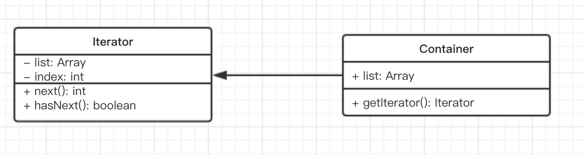

### 迭代器模式

迭代器模式是指提供一种方法顺序访问一个聚合对象中的各个元素，而又不需要暴露该对象的内部表示。迭代器模式可以把迭代的过程从业务逻辑中分离出来，在使用迭代器模式之后，即使不关心对象的内部构造，也可以按顺序访问其中的每个元素。

- 顺序访问一个集合
- 使用者无需知道集合的内部结构(封装)

#### 简化的UML图



```js
class Iterator {
  constructor(container) {
    this.list = container.list;
    this.index = 0;
  }
  next() {
    if(this.hasNext()) {
      return this.list[this.index++];
    }
    return null;
  }
  hasNext() {
    if(this.index >= this.list.length) {
      return false;
    }
    return true
  }
}
class Container {
  constructor(list) {
    this.list = list;
  }
  //生成遍历器
  getIterator() {
    return new Iterator(this)
  }
}
let arr = [1, 2, 3, 4];
let container = new Container(arr);
let iterator = container.getIterator();
while(iterator.hasNext()) {
  console.log(iterator.next());
}
```

#### JQuery each

```js
var arr = [1, 2, 3];
var nodeList = document.getElementsByTagName('p');
var $p = $('p');

//要对这三个变量进行遍历，需要写三个遍历方法

//第一
arr.forEach((item) => {
  console.log(item)
})

//第二
var i, length = nodeList.length;
for(i=0; i<length; i++) {
  console.log(nodeList[i])
}

//第三
$p.each((key, p) => {
  console.log(key, p)
})

//封装到一个
function each(data) {
  var $data = $(data)		//生成迭代器
  $data.each((key, val) => {
    console.log(key, val)
  })
}
each(arr);
each(nodeList);
each($a);
```

#### 自己实现一个迭代器

```js
var each = function( ary, callback ){
  for(let i=0, l=ary.length; i<l; i++) {
      callback.call(ary[i], i, ary[i])		// 把下标和元素当作参数传给 callback 函数
  }
}

each( [ 1, 2, 3 ], function( i, n ){ 
  alert ( [ i, n ] );
});
```

拓展，使其可以迭代类数组对象和字面量对象，

类数组只要符合以下条件就可以被迭代，可以被循环，如`arguments`、`{0: 'a', 1: 'b'}`这类字面量对象：

1. 拥有`length`属性
2. 可以用下标访问，即索引
3. 原型对象上有`[Symbol.iterator]`属性

在JavaScript中，`for in`语句是用来迭代普通字面量对象的属性。

```js
//完善
$.each = function(obj, callback) {
  var value,
      i = 0,
      length = obj.length,
      isArray = isArraylike(obj);
  	
  if(isArray) {	//迭代类数组
    for(; i<length; i++) {
      value = callback.call(obj[i], i, obj[i]);
      
      if(value === false) {
        break;
      }
    }
  } else {
    for(i in obj) {	//迭代object对象
      value = callback.call(obj[i], i, obj[i]);
      if(value === false) {
        break;
      }
    }
  }
  return obj;
}
```

#### 内部迭代器和外部迭代器

迭代器可以分为内部迭代器和外部迭代器，它们有各自的适用场景。

比如现在有个需求，要判断 2 个数组里元素的值是否完全相等， 如果不改写 each 函数本身的代码，我们能够入手的地方似乎只剩下 each 的回调函数了。

##### 内部迭代器

```js
//内部迭代器
var compare = function (ary1, ary2) {
  if (ary1.length !== ary2.length) {
    throw new Error('ary1 和 ary2 不相等');
  }
  each(ary1, function (i, n) {
    if (n !== ary2[i]) {
      throw new Error('ary1 和 ary2 不相等');
    }
  });
  alert('ary1 和 ary2 相等');
};
compare([1, 2, 3], [1, 2, 4]); // throw new Error ( 'ary1和ary2不相等' ); 
```

说实话，这个 compare 函数一点都算不上好看，我们目前能够顺利完成需求，还要感谢在 JavaScript 里可以把函数当作参数传递的特性，但在其他语言中未必就能如此幸运。 

##### 外部迭代器

```js
//外部迭代器
var Iterator = function(obj) {
  var current = 0;
  var next = function() {
    current += 1;
  }
  var isDone = function() {
    return current >= obj.length;
  }
  var getCurrItem = function() {
    return obj[current];
  }
  return {
    next,
    isDone,
    getCurrItem,
    length: obj.length
  }
}

var compare = function(iterator1, iterator2) {
  if(iterator1.length !== iterator2.length) {
    alert(不相等);
  }
  while(!iterator1.isDone() && !iterator2.isDone()) {
    if(iterator1.getCurrItem() !== iterator2.getCurrItem()) {
      throw new Error('不相等')
    }
    iterator1.next();
    iterator2.next();
  }
  alert('相等');
}

var iterator1 = Iterator([1, 2, 3]);
var iterator2 = Iterator([1, 2, 3]);

compare(iterator1, iterator2);		//输出：iterator1和iterator2相等
```

外部迭代器虽然调用方式相对复杂，但它的适用面更广，也能满足更多变的需求。内部迭代器和外部迭代器在实际生产中没有优劣之分，究竟使用哪个要根据需求场景而定。

#### ES6 Iterator

**ES6 Iterator 为何存在？**

- ES6语法中，有序集合的数据类型已经有很多
- Array、Map、Set、String、TypedArray、arguments、NodeList等
- 需要有一个统一的遍历接口来遍历所有数据类型
- （注意：Object不是有序集合，可以使用Map代替）

**ES6 Iterator是什么？**

- 以上数据类型的原型对象上都有`[Symbol.iterator]`属性
- 属性值是**函数**，执行函数返回一个迭代器
- 这个迭代器就有`next`方法可顺序迭代子元素
- 可运行`Array.prototype[Symbol.iterator]`来测试

遍历器（Iterator）就是这样一种机制。它是一种接口，为各种不同的数据结构提供统一的访问机制。任何数据结构只要部署 Iterator 接口，就可以完成遍历操作（即依次处理该数据结构的所有成员）。

Iterator 的作用有三个：一是为各种数据结构，提供一个统一的、简便的访问接口；二是使得数据结构的成员能够按某种次序排列；三是 ES6 创造了一种新的遍历命令`for...of`循环，Iterator 接口主要供`for...of`消费。

ES6 规定，默认的 Iterator 接口部署在数据结构的`Symbol.iterator`属性，或者说，一个数据结构只要具有`Symbol.iterator`属性，就可以认为是“可遍历的”（iterable）。`Symbol.iterator`属性本身是一个函数，就是当前数据结构默认的遍历器生成函数。执行这个函数，就会返回一个遍历器。

```js
Array.prototype[Symbol.iterator]  //返回一个函数，执行该函数返回一个迭代器对象
//f values() { [native code] }

Array.prototype[Symbol.iterator]();
// Array Iterator {}

Array.prototype[Symbol.iterator]().next()
//{value: undefined, done: true}
```

```javascript
const obj = {
  [Symbol.iterator] : function () {
    return {
      next: function () {
        return {
          value: 1,
          done: true
        };
      }
    };
  }
};
```

**怎么样才是类数组的对象？**

- （存在数值键名和`length`属性），部署 Iterator 接口才能被遍历

```javascript
let iterable = {
  a: 'a',
  b: 'b',
  c: 'c',
  length: 3,
  [Symbol.iterator]: Array.prototype[Symbol.iterator]
};
for (let item of iterable) {
  console.log(item); // undefined, undefined, undefined
}
```

#### ES6 Iterator 与 Generator

- Iterator的价值不限于上述几个类型的遍历
- 还有Generator函数的使用
- 即只要返回的数据符合Iterator接口的要求
- 即可使用Iterator语法，这就是迭代器模式

```js
function *helloWorldGenerator() {
  yield 'hello';
  yield 'world';
  return 'ending';
}
let hw = helloWorldGenerator();
hw.next()    //{value: 'hello', done: false}
hw.next()		//{value: 'world', done: false}
hw.next()		//{value: 'ending', done: true}     只有默认到return时， done：true
hw.next()		//{value: undefined, done: true}

//也可以使用for...of
for(let v of foo()) {
  console.log(v)
}
```

#### 设计原则验证

- 迭代器对象和目标对象分离
- 迭代器将使用者与目标对象隔离开
- 符合开放封闭原则

