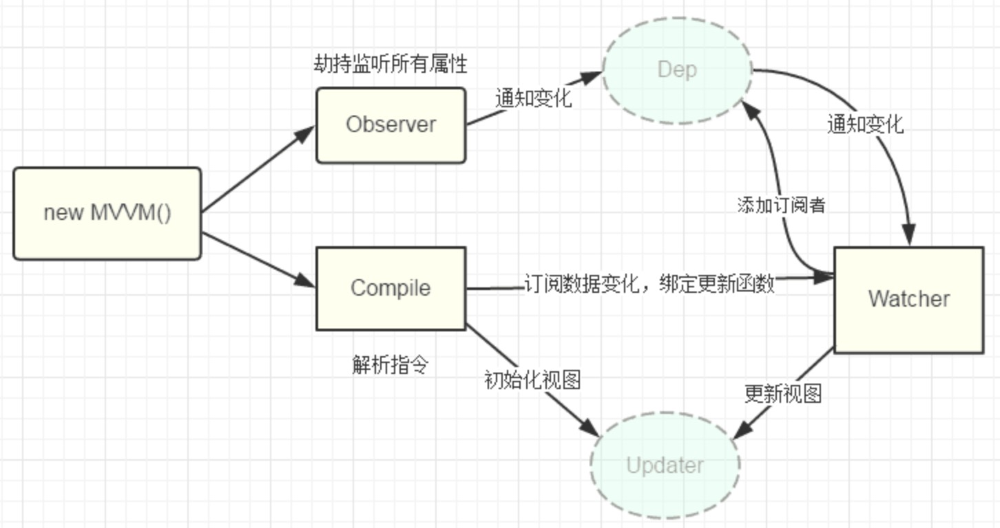
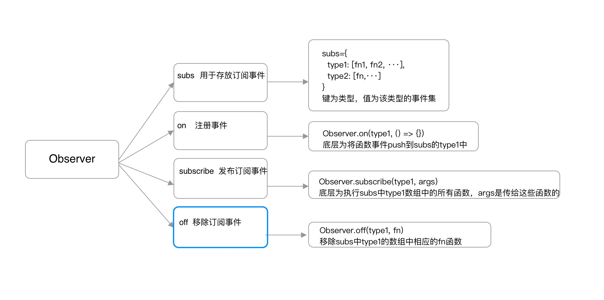

> 观察者模式是软件设计模式的一种。在此种模式中，一个目标对象管理所有相依于它的观察者对象，并且在它本身的状态改变时主动发出通知。就是在数据发生改变时，对应的处理函数自动执行。

### 观察者模式(Observer)

通常又被称为**发布-订阅者模式**或**消息机制**，它定义了对象间的一种一对多的依赖关系，只要当一个对象的状态发生改变时，所有依赖于它的对象都得到通知并被自动更新，解决了主体对象与观察者之间功能的耦合，即一个对象状态改变给其他对象通知的问题。

这就类似我们在微信平台订阅了公众号当它有新的文章发表后，就会推送给我们所有订阅的人。我们可以看到例子中这种模式的优点：

- 我们作为订阅者不必每次都去查看这个公众号有没有新文章发布， 公众号作为发布者会在合适时间通知我们
- 我们与公众号之间不再强耦合在一起。公众号不关心谁订阅了它， 不管你是男是女还是宠物狗，它只需要定时向所有订阅者发布消息即可

其实以下代码就是一个**发布-订阅者模式**：

```js
btn.addEventListener('click', () => {
    alert('hello');
}, false);
```

比如Vue也涉及到了观察者模式：

#### 数据的双向绑定



利用`Object.defineProperty()`对数据进行劫持，设置一个监听器`Observer`，用来监听所有属性，如果属性上发生变化，就告诉订阅者`Watcher`去更新数据，最后指令解析器`Compile`解析对应的指令，进而执行相应的更新函数，从而更新视图，实现双向绑定。

#### $on和$emit组件之间的通信

- `$on`，订阅者
- `$emit`，发布者

```js
vm.$on('aaa', function(data){
    console.log(1, data)
})
vm.$on('aaa', function(data) {
    console.log(2, data)
})

vm.$emit('aaa', 'asds');	//上面两个都执行了
```

#### 网页事件绑定

```js
$('#btn1').click(function() {
  console.log(1)
})
$('#btn1').click(function() {
  console.log(2)
})
$('#btn1').click(function() {
  console.log(3)
})
```

#### 简单实现

```js
let Observe = {
    //存储消息接口
    list: [],
    //注册消息接口
    on(fn) {
        this.list.push(fn);
    },
    //发布消息接口
    subscribe() {
        for(let fn of this.list) {
            fn();
        }
    },
    //移除消息接口
    off() {}
};
let click = function() {
    console.log('click')
}
let hover  = function () {
    console.log('hover ')
}
Observe.on(click);
Observe.on(hover);
Observe.subscribe();
```

这就是观察者模式的雏形，接下来进行完善。


#### 完善观察者模式

```js
let Observe = (function() {
    /*
    1. 将原来的数组改为一个对象。
    2. 键为类型，值为一个数组，用来存放订阅的事件。
    例如： {click: [fn1, fn2, fn3], hover: [fn1]}
    */
    let subs = {};
    return {
        /*
        注册消息接口
        type: 类型，fn: 函数  
        */
        on(type, fn) {
            //如果此消息不存在，创建一个该消息类型
            subs[type] = subs[type] || [];
            //将执行方法推入该消息对应的执行队列中
            subs[type].push(fn);
        },
        /*
        发布消息接口
        type: 类型， dict: 对象
        */
        subscribe(type, dict) {
            //如果该消息没有注册或者没有消息，直接返回
            let fns = subs[type];
            if(!fns || fns.length === 0) return false;
            //遍历执行函数
            for(let fn of fns) {
                fn.call(this, dict);
            }
        },
        /*
        移除消息方法
        */
        off(type, fn) {
            let fns = subs[type];
            //如果消息执行队列存在
            if(!fns) return false;
            //如果第二个参数不传，表示全部删除，并且数组清空
            if(!fn) {
                fns && (fns.length = 0);
            } else {
                //从尾部开始寻找，如果消息方法一致则删除
                for (var i = fns.length - 1; i >= 0; i--) {
                    let _fn = fns[i];
                    if (_fn === fn) {
                        fns.splice(i, 1);
                    }
                }
            }
        }
    }
})();
//订阅消息
Observe.on('click', function(data) {
    console.log(data)
})
Observe.on('move', function(data) {
    console.log(data)
})
//发布消息
Observe.subscribe('click', {a: 1});
Observe.subscribe('move');
```

Vue中的`$on`和`$emit`就是如上原理。



所以在主体中存在几个核心点：

- `subs`是一个对象，用于存储类型和它相应的消息方法的数组集合

```js
//主要这里类型的值是一个数组，将相应类型的消息方法放入数组集合中
subs = {
   	type1: [fn1, fn2,...],
   	type2: [fn1],
    ...
}
```

- `on`方法用于注册消息接口

```js
//存在两个参数，一个时类型(即subs的key值)，一个时要放入类型集合中的消息方法
function on(type, fn) {
    ...
    //放入相应类型的list中
    subs[type].push(fn);
}
```

- `subscribe`方法用于遍历相应类型的数组中的所有消息方法

```js
//dict为传给fn消息方法的参数
function subscribe(type, dict) {
    let fns = subs[type];
    //执行所有该类型的消息方法
    for(let fn of fns) {
        fn.call(this, dict);
    }
}
```

- `off`移除消息方法

```js
function off(type, fn) {
    let fns = subs[type];
    //找到相应类型数组中的相同消息方法移除
    for(/*循环*/){
        if(_fn === fn) {
            //移除
        }
    }
}
```


### 扩展

Vue双向绑定就是数据劫持和发布订阅实现的，我们可以自己来实现一个简单的数据双向绑定。

```html
<div id="app">
	<input type="text" v-model="msg">
   	<div>{{msg}}</div>
    {{msg}}
</div>
```

```js
let vm = new Vue({
    el: '#app',
    data: {
        msg: 'aaa'
    }
})
```

首先创建一个Vue类

```js
class Vue {
    constructor(options) {
        //传入的配置参数
        this.$options = options;
        //数据域
        let data = this._data = options.data;
        //根元素
        this.$el = document.querySelector('#app');
        //保存订阅事件
        this.__subs = {};
        //数据劫持
        this.observe(data);
        //数据代理
        for(let key of Object.keys(data)) {
            Object.defineProperty(this, key, {
                configurable: true,
                get() {
                    return data[key];
                },
                set(newVal) {
                    data[key] = newVal;
                }
            })
        }
        //编译
        this.compile(this.$el, data);
    }
}
```

`observe`方法重新定义`data`的`set`和`get`方法，保证我们在`data`发生变化的时候能够跟踪到，并发布通知，这里主要用到了`Object.defineProperty()`这个方法。

```js
//observe
//对data进行处理，重写data的set和get函数
observe(data) {
    let _this = this;
    //遍历数据
    for(let [key, val] of Object.entries(data)) {
        //data数据的key作为__subs的key，值为一个数组，数组内放该key的订阅事件
        this.__subs[key] = [];
        //重新定义数据的get和set方法
         Object.defineProperty(data, key, {
             get() {
                 return val;
             },
             set(newVal) {
                 if(val === newVal) return false;
                 val = newVal;
                 //发布__subs中相应key中的所有消息事件
                 _this.notify(key, data);
             }
         })
        //递归
        if(typeof val === 'object' ) {
            this.observe(val);
        }
    }
}
```

接下来是`compile`这个方法，这是一个解析器，其功能是解析模板指令，并将每个指令对应的节点绑定更新函数，添加监听数据的订阅者，一旦数据变动，就收到通知，然后更新视图。

```js
compile(node, data) {
    let nodes = node.childNodes;  //包括文本节点，元素节点等
    [...nodes].forEach(node => {
        //文本节点
        if(node.nodeType === 3) {
            //获取节点的文本内容
            let text = node.textContent;
            let reg = /\{\{(.*?)\}\}/g;
            if(reg.test(text)) {
                //参数1：正则规则。函数参数1：匹配文本，函数参数2：()内的值
                node.textContent= text.replace(reg, (match, placeholder) => {
                    //添加消息接口，对__subs相应的key(即data的属性)，值为数组中放入订阅事件
                    this.__subs[placeholder].push((value) => {
                        node.textContent = value;
                    })
                    return placeholder.split('.').reduce((val, key) => {
                        return val[key]
                    }, data);
                })
            }
        }
        //元素节点
        if(node.nodeType === 1) {
            if( node.tagName === 'INPUT' || node.tagName === 'TEXTAREA') {
                //获取元素节点的所有属性，类数组
                let nodeAttr = node.attributes;
                [...nodeAttr].forEach(attr => {
                    let name = attr.name;   //属性名
                    let exp = attr.value;   //属性值
                    if(name.includes('v-model')) {
                        node.value = data[exp];
                        //添加消息接口
                        this.__subs[exp].push((value) => {
                            node.value = value;
                        })
                    }
                    node.addEventListener('input', (e) => {
                        let newValue = e.target.value;
                        this[exp] = newValue;
                    })
                })
            }
            //递归
            if(node.childNodes && node.childNodes.length) {
                this.compile(node, data);
            }
        }
    });
}
```

```js
//发布订阅事件， 对__subs中的某个key的值，数组中的所有订阅事件执行
notify(key, data) {
    let subs = this.__subs,
        fns;
    for(let _key of Object.keys(subs)) {
        if(key === _key) {
            fns = subs[_key];
            break;
        }
    }
    for(let fn of fns) {
        fn(data[key]);
    }
}
```

此模式另一个名称是 `订阅/发布模式` 。设计这种模式原因是促进形成松散耦合，在这种模式中，并不是一个对象调用另一个对象的方法，而是一个对象订阅另一个对象的特定活动并在状态改编后获得通知。订阅者因此也成为观察者，而被观察的对象成为发布者或者主题。当发生了一个重要事件时候发布者会通知（调用）所有订阅者并且可能经常已事件对象的形式传递消息。


### 小结

发布—订阅模式的优点非常明显，一为时间上的解耦，二为对象之间的解耦。它的应用非常 广泛，既可以用在异步编程中，也可以帮助我们完成更松耦合的代码编写。发布—订阅模式还可 以用来帮助实现一些别的设计模式，比如中介者模式。从架构上来看，无论是 MVC 还是 MVVM， 都少不了发布—订阅模式的参与，而且 JavaScript 本身也是一门基于事件驱动的语言。 

当然，发布—订阅模式也不是完全没有缺点。创建订阅者本身要消耗一定的时间和内存，而 且当你订阅一个消息后，也许此消息最后都未发生，但这个订阅者会始终存在于内存中。另外， 发布—订阅模式虽然可以弱化对象之间的联系，但如果过度使用的话，对象和对象之间的必要联 系也将被深埋在背后，会导致程序难以跟踪维护和理解。特别是有多个发布者和订阅者嵌套到一 起的时候，要跟踪一个 bug 不是件轻松的事情。 