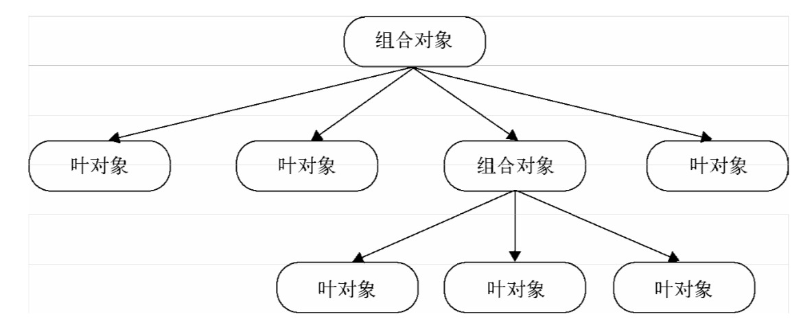

### 组合模式

- 生成树形结构，表示=="整体-部分"==关系(即将很多相关联的对象组合起来，组成树形结构，一层一层)
- 让整体和部分都具有一致的操作方式
- 组合模式使得我们只需要关心最外层的组合对象就行了

比如文件夹下的文件

```
- 文件夹
	- 文件
	- 文件
	- 文件夹
		- 文件
		- 文件夹
			- 文件
			- 文件
```

比如虚拟Dom

```js
{
  tag: 'div',
  attr: {
    id: 'div1',
    className: 'container'
  },
  children: [
    {
      tag: 'div',
      attr: {},
      children: ['123']
    },
    {
      tag: 'p',
      attr: {},
      children: ['356']
    }
  ]
}
```

组合模式将对象组合成树形结构，以表示"部分-整体"的层次结构。除了用来表示树形结构之外，组合模式的另一个好处是通过对象的多态性表现，使得用户对单个对象和组合对象的使用具有一致性。



总而言之，如果子节点是叶对象，叶对象自身会处理这个请求，而如果子节点还是组合对象，请求会继续往下传递。叶对象下面不会再有其他子节点，一个叶对象就是树的这条枝叶的尽头，组合对象下面可能还会有子节点。

请求从上到下沿着树进行传递，直到树的尽头。作为客户，只需要关心树最顶层的组合对象，客户只需要请求这个组合对象，请求便会沿着树往下传递，依次到达所有的叶对象。

#### 例子1

当我按下遥控器的时候：

- 打开空调
- 打开电视和音响
- 关门、开电脑、登录QQ

```js
var MacroCommand = function() {
  return {
    commandsList: [],
    add(command) {
      this.commandsList.push(command);
    },
    execute() {
      for(var i=0, command; command=this.commandsList[i++];) {
        command.execute();
      }
    }
  }
}
var openAcCommand = {
  execute() {
    console.log('打开空调');
  }
}

/**********家里的电视和音响是连接在一起的，所以可以用一个宏命令来组合打开电视和打开音响的命令 *********/
var openTvCommand = { 
  execute: function(){
		console.log( '打开电视' ); 
  },
  add() {
    throw new Error('叶对象不能添加子节点')
  }
};
var openSoundCommand = { 
  execute: function(){
		console.log( '打开音响' ); 
  }，
  add() {
    throw new Error('叶对象不能添加子节点')
  }
};
var macroCommand1 = MacroCommand();
macroCommand1.add( openTvCommand );
macroCommand1.add( openSoundCommand );

/*********关门、打开电脑和打登录 QQ 的命令****************/
var closeDoorCommand = { 
  execute: function(){
		console.log( '关门' ); 
  }，
  add() {
    throw new Error('叶对象不能添加子节点')
  }
};
var openPcCommand = { 
  execute: function(){
		console.log( '开电脑' ); 
  }，
  add() {
    throw new Error('叶对象不能添加子节点')
  }
};
var openQQCommand = {
  execute: function(){
		console.log( '登录 QQ' );
  }，
  add() {
    throw new Error('叶对象不能添加子节点')
  }
};
var macroCommand2 = MacroCommand();
macroCommand2.add( closeDoorCommand );
macroCommand2.add( openPcCommand );
macroCommand2.add( openQQCommand );

/*********现在把所有的命令组合成一个“超级命令”**********/
var macroCommand = MacroCommand(); 
macroCommand.add( openAcCommand ); 
macroCommand.add( macroCommand1 ); 
macroCommand.add( macroCommand2 );

/*********最后给遥控器绑定“超级命令”**********/
var setCommand = (function( command ){
  document.getElementById( 'button' ).onclick = function(){
		command.execute(); 
  }
})( macroCommand );

/*
	打开空调
	打开电视
	打开音响
	关门
	开电脑
	登录 QQ
*/
```


每当对最上层的对象进行一次请求时，实际上是在对整个树进行深度优化的搜索，而创建组合对象的程序员并不关心这些内在的细节，往这颗树里面添加一些新的节点对象是非常容易的事情。

在JavaScript中实现组合模式的难点在于要保证组合对象和叶对象对象拥有同样的方法。

#### 例子2

文件夹和文件之间的关系，非常适合用组合模式来描述。文件夹里既可以包含文件，又可以包含其他文件夹，最终可能组合成一棵树，组合模式在文件夹的应用中有以下两层好处：

1. 如果要复制黏贴，不用管我要复制的文件或文件夹下是什么内容，直接复制黏贴就行。组合模式让ctrl+v、ctrl+c成为了一个统一的操作。
2. 当我用杀毒软件扫描该文件夹时，往往不会关心里面有多少文件和子文件夹，组合模式使得我们只需要操作最外层的文件夹进行扫描

```js
/******************************* Folder ******************************/
var Folder = function(name) {
  this.name = name;
  this.files = [];
}

Folder.prototype.add = function(file) {
  this.files.push(file);
}

Folder.prototype.scan = function(){
  console.log( '开始扫描文件夹: ' + this.name );
  for(var i=0, file, files=this.files; file=files[i++];) {
    file.scan();
  }
}

/*******************************File ******************************/
var File = function( name ){
	this.name = name; 
};
File.prototype.add = function(){
	throw new Error( '文件下面不能再添加文件' );
};
File.prototype.scan = function(){
	console.log( '开始扫描文件: ' + this.name );
};
//接下来创建一些文件夹和文件对象， 并且让它们组合成一棵树
var folder = new Folder( '学习资料' ); 
var folder1 = new Folder( 'JavaScript' ); 
var folder2 = new Folder ( 'jQuery' );

var file1 = new File( 'JavaScript 设计模式与开发实践' );
var file2 = new File( '精通 jQuery' );
var file3 = new File( '重构与模式' );

folder1.add( file1 );
folder2.add( file2 );

folder.add( folder1 );
folder.add( folder2 );
folder.add( file3 );
```

通过这个例子，我们再次看到客户是如何同等对待组合对象和叶对象。在添加一批文件的操作过程中，客户不用分辨它们到底是文件还是文件夹。新增加的文件和文件夹能够很容易地添加到原来的树结构中，和树里已有的对象一起工作。

