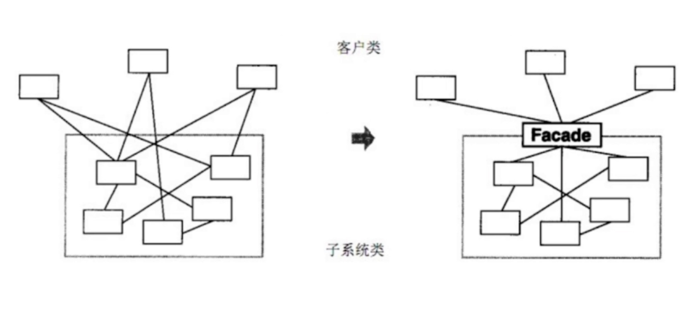
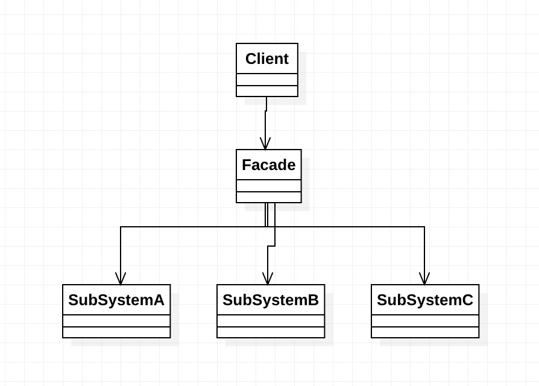

### 外观模式

- 为子系统中的一组接口提供了一个高层接口
- 使用者使用这个高层接口






```js
function bindEvent(elem, type, selector, fn) {
  if(fn === undefined) {
    fn = selector;
    selector = null;
  }
}
//调用， 不传selector这个参数的值，直接第三个函数是fn函数了
bindEvent(elem, 'click', '#div', fn);
bindEvent(elem, 'click', fn);
```

#### 设计原则验证

- 不符合单一职责原则和开发封闭原则，因此谨慎使用，不可滥用。