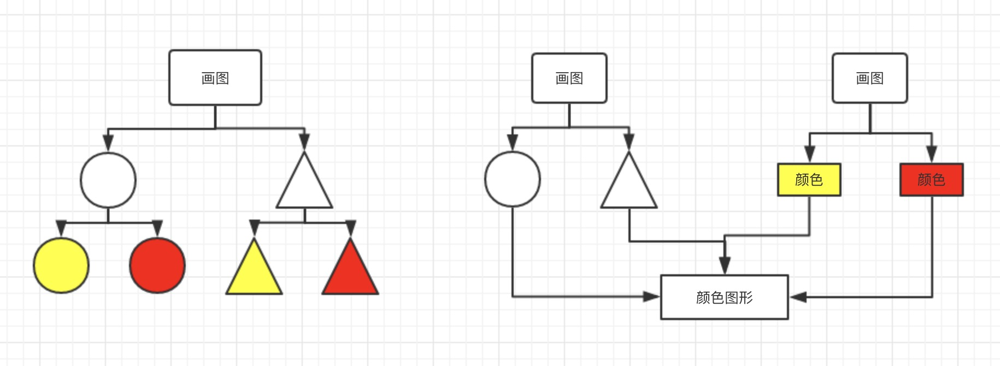

### 桥接模式

- 用于把抽象化与实现化解耦
- 使得二者可以独立变化



```js
//左图，将所有的颜色和状态全都写在一起，当新增一种颜色，或者图形的时候要去函数内部修改，不符合封闭-开发原则
class ColorShape {
  yellowCircle() {
    console.log('yellow circle')
  }
  redCircle() {
    console.log('red circle')
  }
  yellowTriangle() {
    console.log('yellow triangle')
  }
  redTriangle() {
    console.log('red triangle')
  }
}
let cs = new ColorShape();
cs.yellowCircle();
cs.redCircle();
cs.yellowTriangle();
cs.redTriangle();
```

```js
//右图，将颜色和形状分离开，桥接模式
class Color {
  constructor(name) {
    this.name = name;
  }
}
class Shape {
  constructor(name, color) {
    this.name = name;
    this.color = color;
  }
  draw() {
    console.log(`${this.color.name} ${this.name}`);
  }
}
let red = new Color('red');
let yellow = new Color('yellow');
//画圆，颜色红
let circle = new Shape('circle', red);
circle.draw();
//画三角，颜色黄
let triangle = new Shape('triangle', yellow);
triangle.draw();
```

